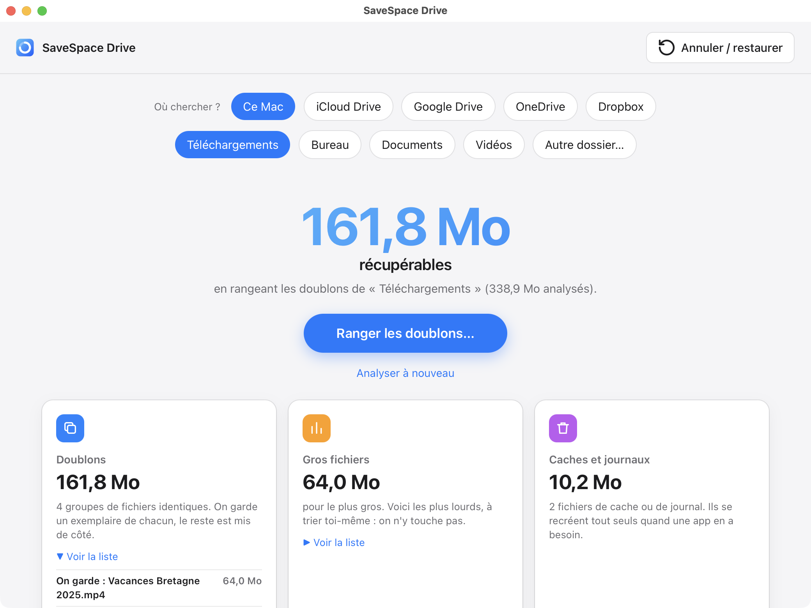
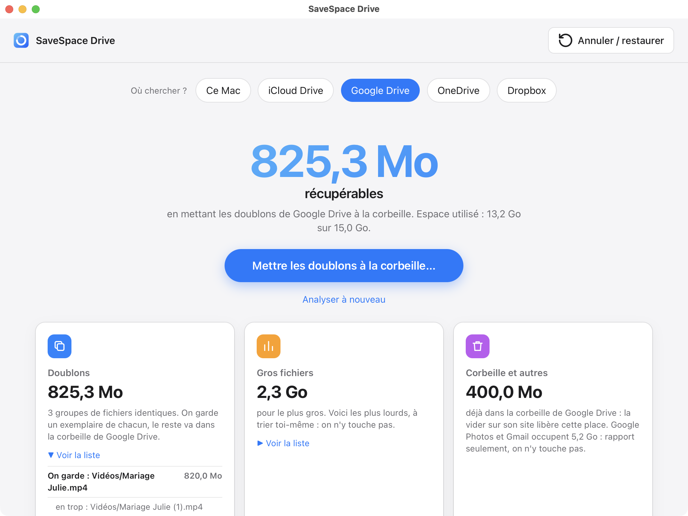

# SaveSpace Drive

Retrouve de la place sur ton ordinateur, ton iCloud Drive, ton Google Drive, OneDrive ou Dropbox :
doublons, gros fichiers et caches repérés en quelques secondes, rangés en un clic, annulables. Gratuit,
open source (MIT). Rien n'est envoyé chez nous ; un drive en ligne n'est contacté que si tu le connectes.



## Installer (rien n'est payant)
L'app n'est pas signée par un certificat payant : c'est un choix, tout est gratuit.

**Mac — au choix :**
- **Terminal, sans aucun avertissement** (copie l'app dans Applications, ne laisse rien d'autre) :
  ```sh
  curl -fsSL https://raw.githubusercontent.com/josslignio/savespace-drive/main/install.sh | sh
  ```
- **Le fichier .dmg** (page [Releases](https://github.com/josslignio/savespace-drive/releases)) : l'ouvrir,
  glisser SaveSpace Drive sur Applications, l'ouvrir. macOS dit « Apple ne peut pas vérifier… » →
  **Terminé**. Puis **Réglages Système → Confidentialité et sécurité** → tout en bas,
  **Ouvrir quand même** → confirmer. Une seule fois.

**Windows :** le `.exe` de la page Releases. Windows affiche une fois « Windows a protégé votre
ordinateur » → **Informations complémentaires** → **Exécuter quand même**. Une version Microsoft Store
(sans aucun avertissement) est prévue. La version Windows est encore peu testée : signale tout souci
dans les Issues.

## Utiliser
1. Choisis un dossier (Téléchargements, Bureau, Documents, Vidéos ou un autre).
2. **Analyser** : rien n'est touché, tu vois ce que tu peux récupérer.
3. **Ranger les doublons** : la liste exacte des fichiers s'affiche d'abord ; rien ne bouge sans ton
   « Oui ». On garde l'original (pas « Copie de… » ni « (1) »), les copies vont dans un dossier
   `quarantaine`.
4. **Annuler / restaurer** remet tout en place, à l'identique (chaque fichier vérifié par empreinte).

**Où chercher ?** Ce Mac, **iCloud Drive**, **Google Drive**, **OneDrive** ou **Dropbox**.
- iCloud Drive : comme un dossier du Mac. Attention : mettre un fichier de côté le retire aussi de ton
  iPhone et de tes autres appareils (il revient avec « Annuler / restaurer »).
- Google Drive, OneDrive, Dropbox : **Connecter** ouvre la page de connexion du service dans ton navigateur
  (l'app ne voit jamais ton mot de passe). L'analyse lit seulement la liste des fichiers et les empreintes
  calculées par le service : **rien n'est téléchargé**. Les doublons vont dans la **corbeille du service**
  (récupérables 30 jours sur son site), jamais effacés pour de bon. Le moteur gratuit rclone est inclus.



## Limites, en clair
- La quarantaine reste sur le même disque : la place n'est libérée que quand tu la vides toi-même.
- Les fichiers « seulement dans iCloud » (Bureau et Documents synchronisés, iCloud Drive) sont ignorés : jamais
  ouverts, donc jamais téléchargés ; ils sont comptés à part. Seuls les fichiers présents sur le Mac sont examinés.
- Les gros fichiers et les caches sont montrés, jamais supprimés : à toi de décider.
- Le dossier personnel entier et la racine du disque sont refusés (trop risqué en un clic).
- Google Drive, OneDrive, Dropbox : essayés seulement avec un faux service et un disque local (tests) ;
  **jamais encore sur un vrai compte**. « Annuler » ne peut pas les remettre en place : on te donne le lien de
  la corbeille du service, c'est là que tu restaures. Les Google Docs/Sheets n'ont pas d'empreinte : jamais
  comptés comme doublons. Deux fichiers au même nom au même endroit (Drive le permet) ne sont jamais proposés.
- Google Photos et Gmail : leur place est affichée (rapport seulement), on n'y touche pas.
- La place d'un drive n'est libérée que quand sa corbeille est vidée (sur son site, ou seule après 30 jours).
- L'app pèse plus lourd (≈ 220 Mo sur Mac) : elle contient le moteur rclone officiel pour les deux puces.
- En ligne de commande, `doublons` garde encore le premier nom par ordre alphabétique (l'app, elle,
  garde l'original).

## Ligne de commande (pour les curieux)
```sh
pipx install git+https://github.com/josslignio/savespace-drive
savespace-drive analyse --racine ~/Downloads
```
Commandes : `analyse` (à blanc), `doublons`, `gros`, `caches`, `restaure`, `doctor` (moteurs
optionnels : czkawka, rclone, osxphotos, dua). Ajoute `--json` pour une sortie machine.

## Crédits
Moteurs optionnels pris tels quels, tous libres : czkawka, rclone, osxphotos, dua/gdu ; emplacements de
caches repris de mac-cleaner-cli ; fenêtre par pywebview ; paquet par PyInstaller. Merci à leurs auteurs
(voir `THIRD_PARTY/`).

---

## English
**SaveSpace Drive** finds duplicates, big files and caches, and tidies duplicates away in one click —
always undoable, 100 % local, free and open source (MIT). Install: the one-line Terminal command or the
`.dmg` above (Mac, unsigned: *System Settings → Privacy & Security → Open Anyway* once), or the `.exe`
(Windows: *More info → Run anyway* once). Duplicates go to a `quarantaine` folder, never deleted;
*Annuler / restaurer* puts everything back.
